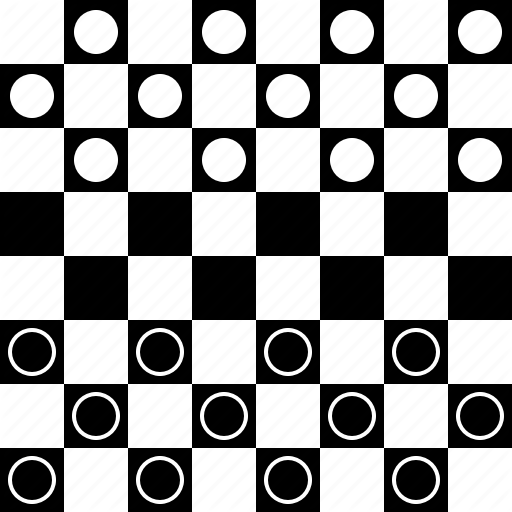
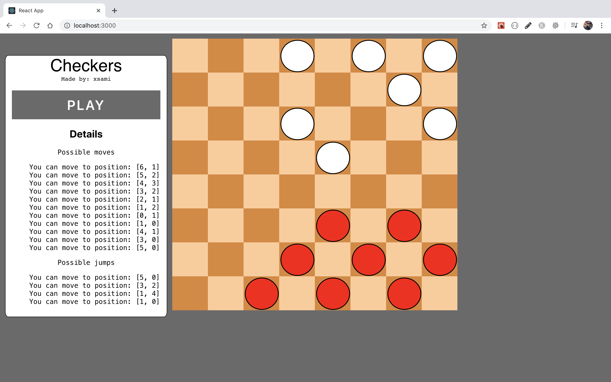

# Checkers.js 

This project was bootstrapped with [Create React App](https://github.com/facebook/create-react-app).

The main purpose of this application is to allow users online play Checkers with other friends.

The application is on progress but you can check the code and contribute with this game :).

## How to play

The current stage of the game only allows to set the pieces on the board. The following image displays a demo of the application


## How to run

The game was developed using react.js, so you can either build and opend the index file in the `dist/` folder or by running:
```
$ npm install
$ npm start
```
or
```
$ yarn .
$ yarn start
```

and open the browser in the specified port. 


## TODOS

- Dragrabble functionality
- Display Winner
- Validate moves
- King creation
- AI for self playing
- Display posible moves by a current piece
- Check for firebase deploying 
- Make unit testing

Made with :coffee: by xsami